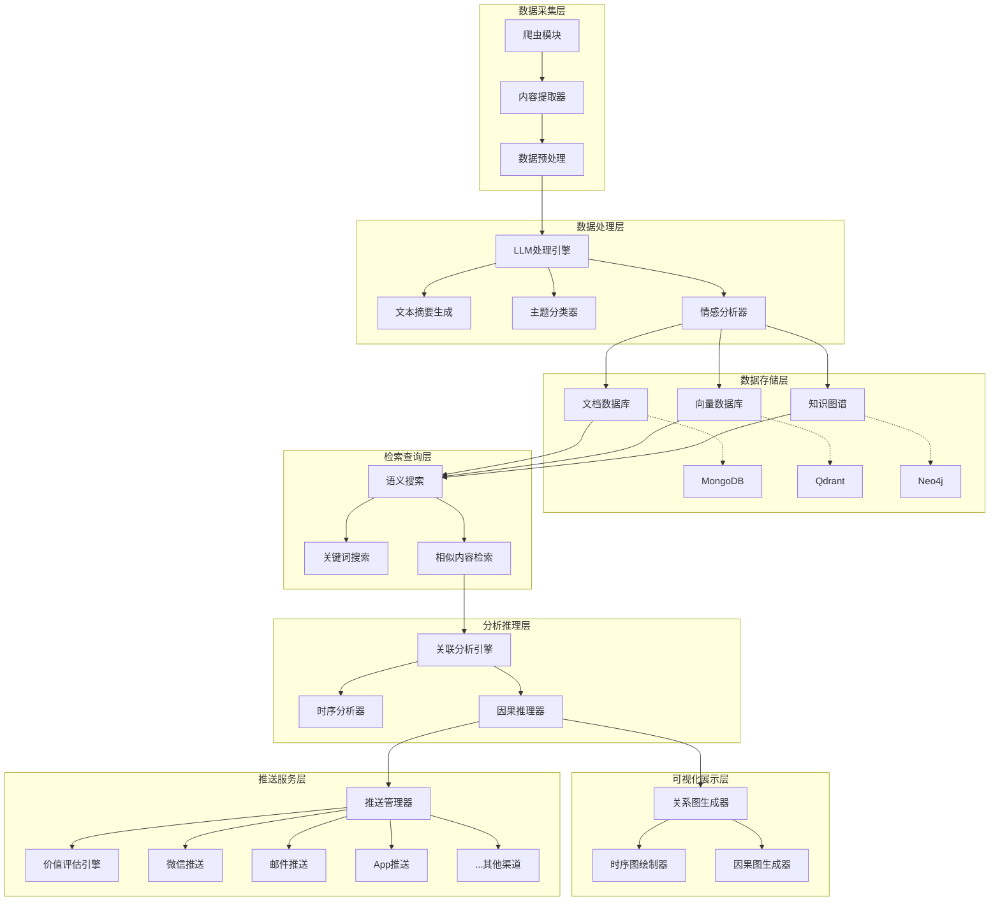
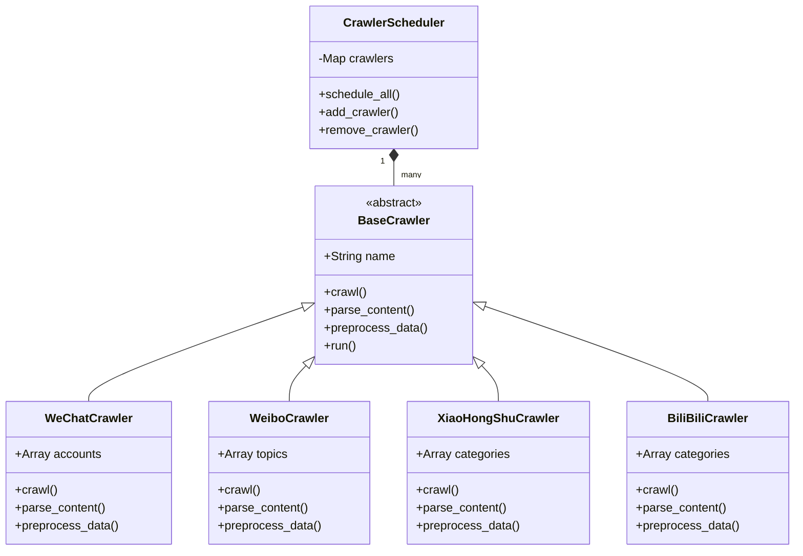
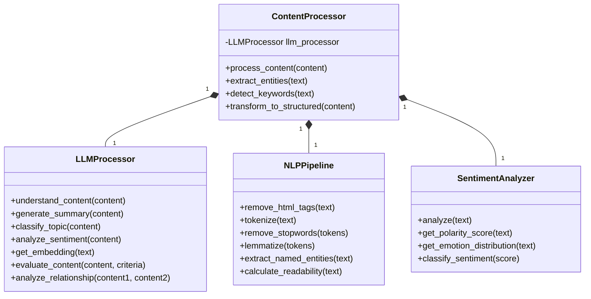
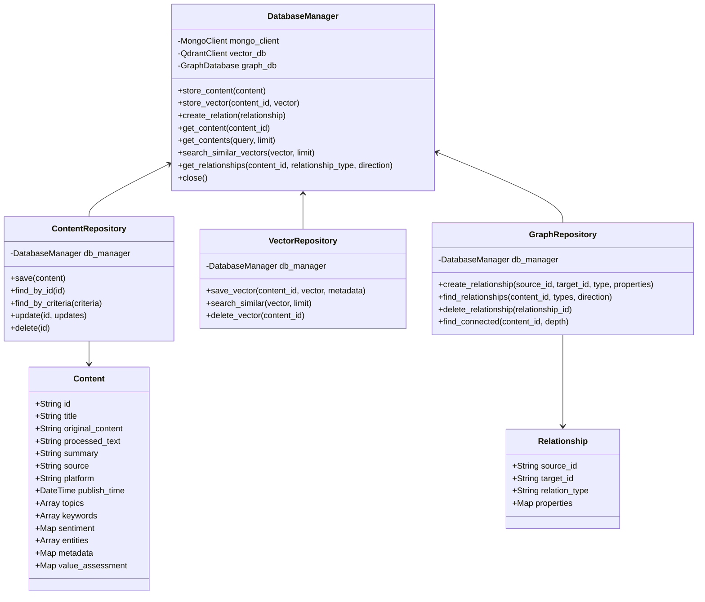
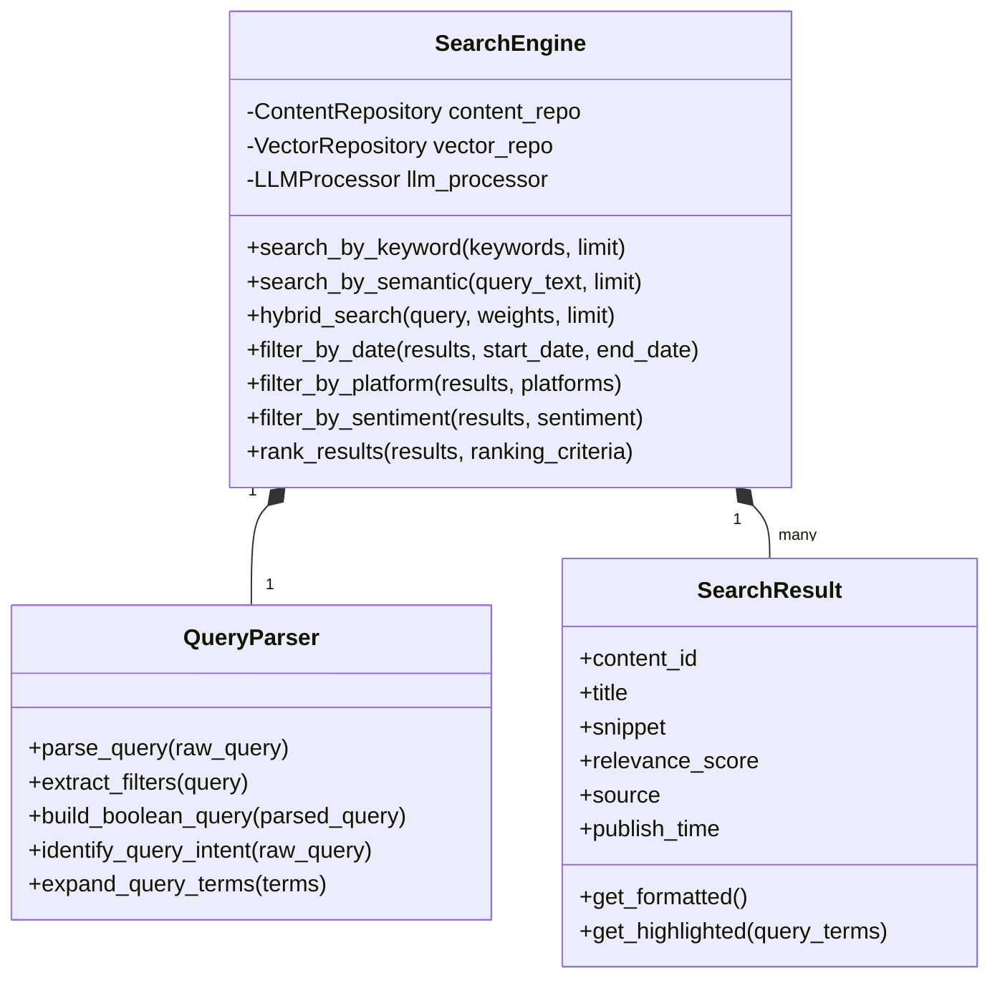
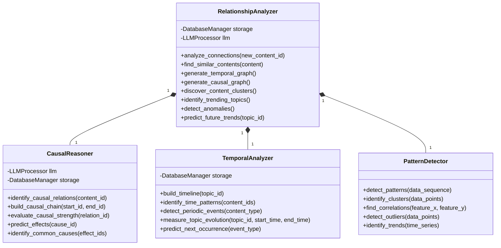
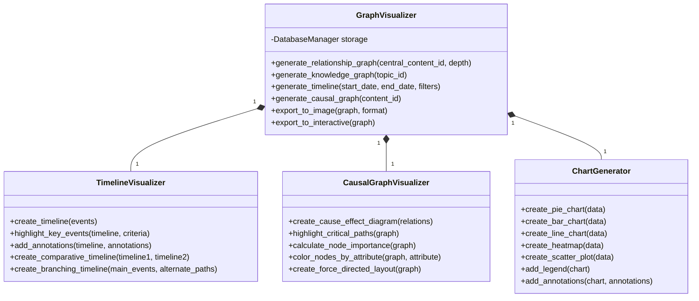
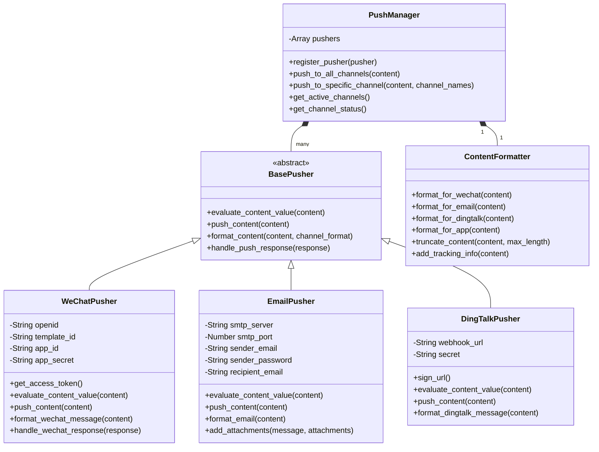
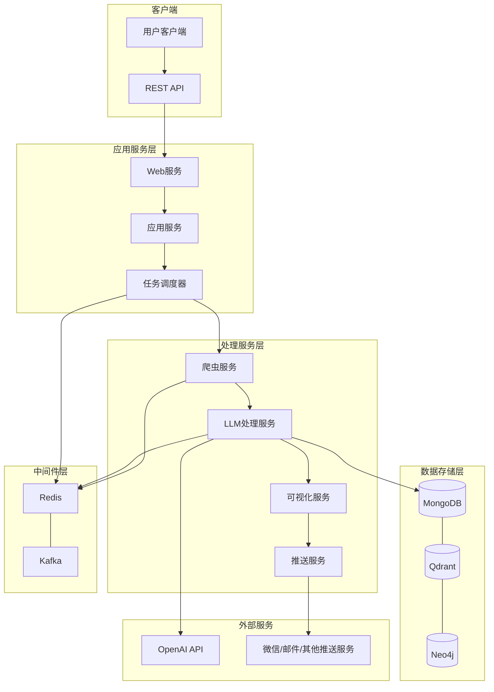

# 个人信息助理系统 - 系统架构

## 一、系统分层架构

个人信息助理系统采用模块化、分层设计，确保系统的可扩展性和可维护性。

### 总体架构图


### 数据流向 


## 二、核心模块详细设计

### 1. 数据采集层


### 2. 数据处理层


### 3. 数据存储层


### 4. 检索查询层


### 5. 分析推理层


### 6. 可视化展示层


### 7. 推送服务层


## 三、系统部署架构


## 四、扩展性设计

该设计方案的扩展性体现在以下几个方面：

1. **模块化设计**：每个功能独立成模块，便于扩展和替换
2. **抽象基类**：关键组件如爬虫、推送渠道等都基于抽象基类实现
3. **配置驱动**：通过配置文件控制系统行为，无需修改代码
4. **消息队列**：使用Redis/Kafka实现模块间松耦合通信
5. **插件机制**：可以轻松添加新的爬虫、分析器、推送渠道等

## 五、数据模型与存储结构

### 文档数据库 (MongoDB) 存储结构

```json
// 内容集合 (contents)
{
  "_id": ObjectId("60a5e8a9b54b12c5a8c4d786"),
  "title": "人工智能在医疗领域的应用",
  "original_content": "原始内容...",
  "processed_text": "处理后的内容...",
  "summary": "这是一篇关于AI在医疗领域应用的文章...",
  "source": "微信公众号-AI前沿",
  "platform": "wechat",
  "publish_time": ISODate("2023-05-20T08:30:00Z"),
  "formatted_time": "2023-05-20 16:30:00",
  "crawl_time": ISODate("2023-05-20T09:15:00Z"),
  "topics": ["人工智能", "医疗", "技术应用"],
  "keywords": ["AI", "医疗诊断", "辅助决策", "影像识别"],
  "sentiment": {
    "score": 0.85,
    "label": "positive",
    "emotions": {
      "joy": 0.6,
      "surprise": 0.3,
      "fear": 0.05,
      "anger": 0.0,
      "sadness": 0.05
    }
  },
  "entities": [
    {"text": "人工智能", "type": "TECHNOLOGY", "start": 0, "end": 4},
    {"text": "医疗", "type": "FIELD", "start": 5, "end": 7}
  ],
  "metadata": {
    "word_count": 1250,
    "read_time_minutes": 6,
    "author": "张三",
    "original_url": "https://example.com/article/123",
    "image_urls": ["https://example.com/images/1.jpg"]
  },
  "value_assessment": {
    "overall_score": 8.5,
    "relevance": 9,
    "timeliness": 8,
    "importance": 9,
    "uniqueness": 7
  },
  "user_interactions": {
    "view_count": 15,
    "last_viewed": ISODate("2023-05-25T14:20:00Z"),
    "is_favorited": true,
    "tags": ["重要", "医疗AI"]
  }
}

// 用户配置集合 (user_configs)
{
  "_id": ObjectId("60a5e8a9b54b12c5a8c4d787"),
  "user_id": "user123",
  "username": "张三",
  "email": "zhangsan@example.com",
  "created_at": ISODate("2023-01-15T08:30:00Z"),
  "preferences": {
    "topics_of_interest": ["人工智能", "健康", "科技"],
    "platforms": ["wechat", "weibo", "bilibili"],
    "push_channels": ["email", "wechat"],
    "push_frequency": "daily",
    "min_push_score": 7.5
  },
  "notification_settings": {
    "email": {
      "enabled": true,
      "address": "zhangsan@example.com",
      "digest_time": "18:00"
    },
    "wechat": {
      "enabled": true,
      "openid": "wx123456"
    }
  }
}
```

### 向量数据库 (Qdrant) 存储结构

```json
// 向量点
{
  "id": "60a5e8a9b54b12c5a8c4d786",  // 与MongoDB中内容的_id对应
  "vector": [0.12, 0.45, 0.68, ...],  // 1536维的embedding向量
  "payload": {
    "content_id": "60a5e8a9b54b12c5a8c4d786",
    "title": "人工智能在医疗领域的应用",
    "platform": "wechat",
    "publish_time": "2023-05-20T08:30:00Z",
    "topics": ["人工智能", "医疗", "技术应用"],
    "summary": "这是一篇关于AI在医疗领域应用的文章..."
  }
}
```

### 图数据库 (Neo4j) 存储结构

```cypher
// 内容节点
CREATE (c:Content {
  id: "60a5e8a9b54b12c5a8c4d786",
  title: "人工智能在医疗领域的应用",
  platform: "wechat",
  publish_time: "2023-05-20T08:30:00Z"
})

// 主题节点
CREATE (t:Topic {
  name: "人工智能",
  category: "技术"
})

// 实体节点
CREATE (e:Entity {
  name: "医疗诊断",
  type: "CONCEPT"
})

// 创建关系
CREATE (c)-[:BELONGS_TO]->(t)
CREATE (c)-[:MENTIONS]->(e)

// 内容之间的关系
CREATE (c1)-[:CAUSES {
  description: "AI技术进步导致了医疗诊断效率提高",
  strength: 0.85
}]->(c2)

CREATE (c1)-[:FOLLOWS {
  time_gap: "3 days",
  description: "后续进展"
}]->(c2)

CREATE (c1)-[:CONTRADICTS {
  description: "提出了不同观点",
  degree: 0.7
}]->(c2)
```
