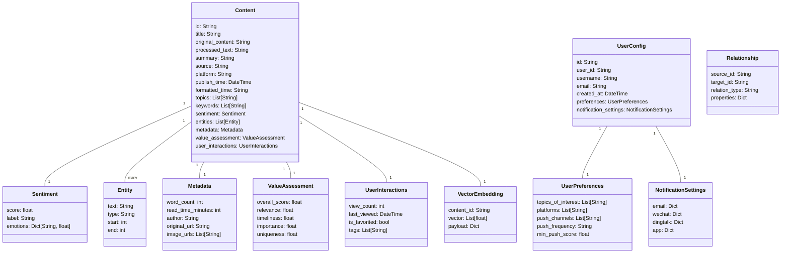
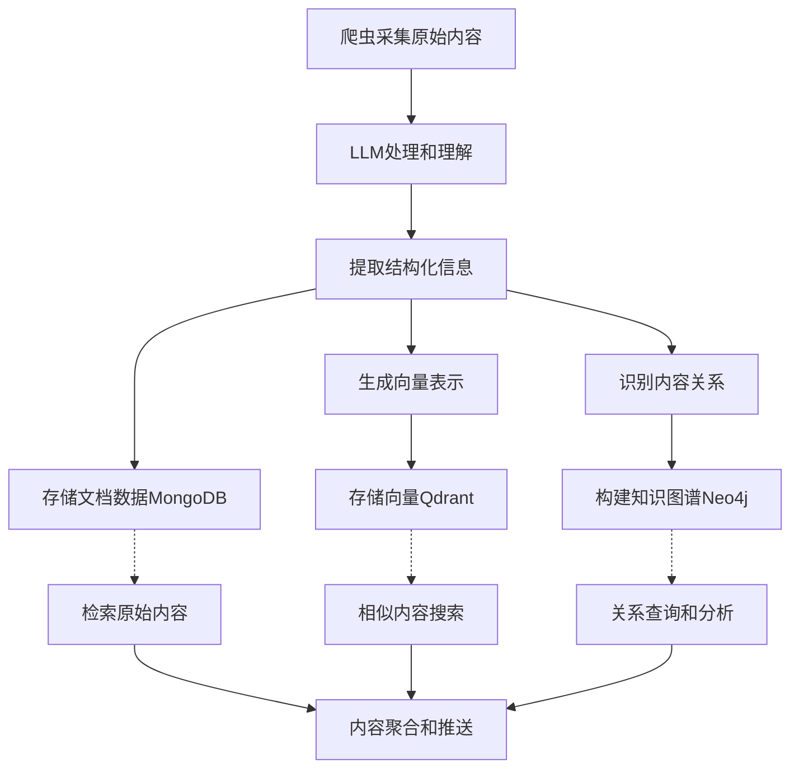

# 个人信息助理系统 - 数据库架构

## 数据模型图

## 多数据库存储架构

个人信息助理系统采用多数据库策略，根据不同数据类型选择最合适的存储方式。

### 1. 文档数据库（MongoDB）

MongoDB用于存储结构化和半结构化的内容数据，包括：
- 爬取的原始内容
- 处理后的文本
- 元数据信息
- 用户配置
- 系统设置

**主要集合**：
- `contents`: 存储所有采集的内容
- `user_configs`: 存储用户配置信息

**indexes**:
- contents集合: 
  - 文本索引: title, processed_text
  - 复合索引: platform + publish_time
  - 单字段索引: topics, keywords
- user_configs集合:
  - 唯一索引: user_id
  - 单字段索引: email

### 2. 向量数据库（Qdrant）

Qdrant用于存储内容的向量表示，支持语义搜索和相似内容推荐。

**主要集合**：
- `content_vectors`: 存储内容的向量嵌入

**向量配置**：
- 维度: 1536 (基于OpenAI的embedding模型)
- 距离度量: cosine

### 3. 图数据库（Neo4j）

Neo4j用于存储内容之间的关系，支持关系分析和知识图谱构建。

**节点类型**：
- `Content`: 内容节点
- `Topic`: 主题节点
- `Entity`: 实体节点

**关系类型**：
- `BELONGS_TO`: 内容属于某主题
- `MENTIONS`: 内容提及某实体
- `CAUSES`: 因果关系
- `FOLLOWS`: 时序关系
- `CONTRADICTS`: 矛盾关系
- `SIMILAR_TO`: 相似关系
- `REFERS_TO`: 引用关系

## 数据流示意图

